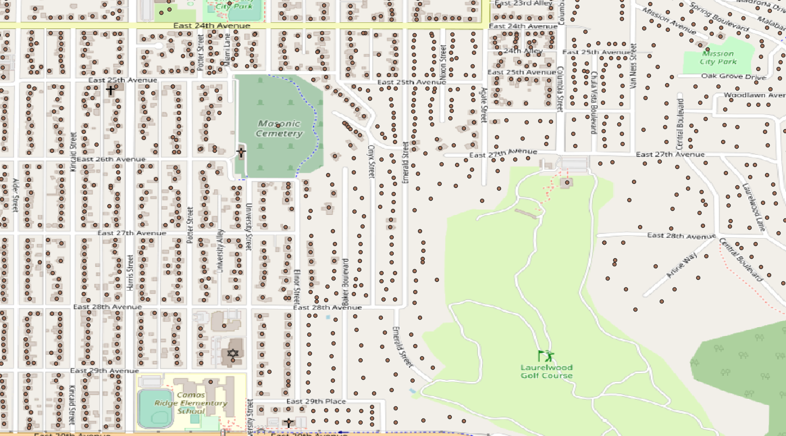

# 360img_uploader

Command line tool that loads the time and location metadata of 360 photos into a postgres database.
It then tileizes them and determines yaw values for the viewer if they meet spatial requirements (the coordinates are within a certain distance
of a house in the address db table).

A PostgreSQL db must be used. This script relies on functions from the POSTGIS extension to properly load and maintain the necessary image metadata.

The database contains a table with all address points in lane country. Above you can see a visualization of them using QGIS.

This script: - Called on PANO_UPLOAD directory - for file in directory: - Extracts timestamp and GPS_lat and GPS_lon using exiftool (PYTHON) - Converts the GPS coords in degrees/min/sec to decimal (PYTHON) - Creates string of MD5(GPS coords, timestamp) = filename (PYTHON) - Adds entry (filename, GPS_lat, GPS_lon, timestamp) (PYTHON) - Execute an SQL script that orders them based on timestamp, then for ID i,  
 adds the i+1 lat,lon to next_lat, next_lon for i (potentially fill last entry with
coordinates that would be on the same line as that made by the previous two points) - Execute SQL script addrtoFileID to group file ID's per address. - Remove all files and their DB entry that have no references to them - for file in directory: - Changes krpano config file to create tiles at dir xx/x/xxxxx... (file string) - Execute krpano -config file
